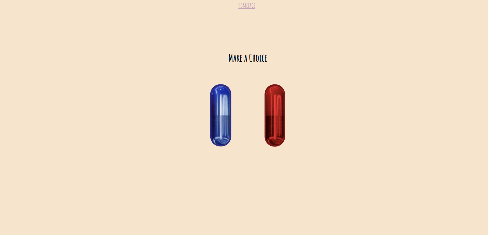

# The BoringApp

## Description

This project has for purpose to challenge our skills with the latest knowledge in Javascript, HTML and CSS by creating a **real-world** front-end application with the idea to potentially showcase it to future employers. 

## Objectives

## Functionality
In order to prevent and control boredom during working breaks, we - Niko de Silva, Zahra Mammadli, Nabil Nasser and Olivier R.Measson - have been working on developing an interactive front-end application that has for purpose to "cure" your boredom. 
The application permits for a user to "make a choice" between watching random videos using the **youtube API** or to learn something using the **bored API**. 

This project permitted us to learn how to work as a team.
Using Github, we've been able to succesfully separate equally the tasks and maintain a proper workflow to achieve our goals. 
We learned how to created different branches and how (and also when) to merge them. 
We also learned how to apply different server-side API's in our application. 

## Usage

First, the user needs to start the BoaringApp by clicking on the *Entertain me* button 

 

Once the click this button they will access to the next page where the user will face a choice between two pills: A random youtube video (red pill) or a random Activity (blue pill).
coding_bootcamp\\Images\screenshots\blue-pill-choice.png

 

If the user decides for the blue pill: he will have a randoma activity proposed - if he optes for the red pill the user will be shown random videos. 

 
 

## Credits

This work has been a collaboration between:
[Niko de Silva](https://github.com/queenmcsteve), [Zahra Mammadli](https://github.com/ZahraMammadli), [Nabil Nassar](https://github.com/nnassarv) & [Olivier R.Measson](https://github.com/Zeitouna)

with the help of:

[Swapnil Gaikwad](https://github.com/swapbcs)
